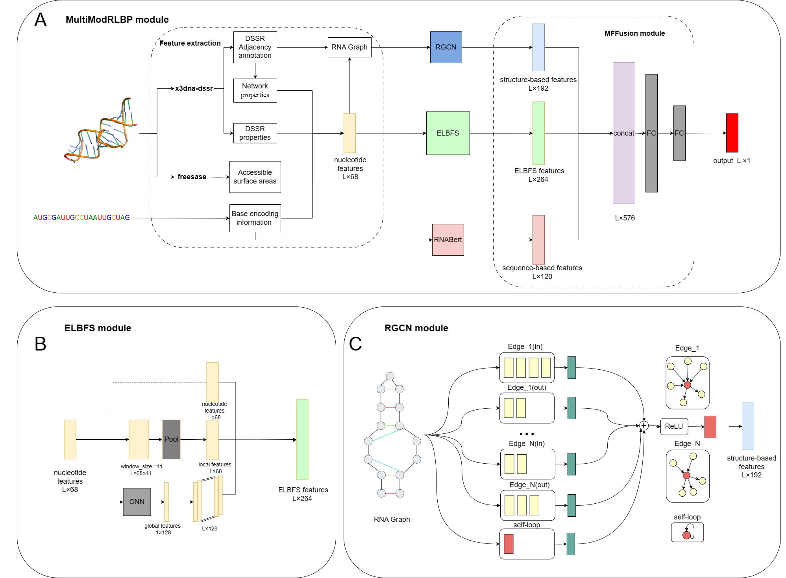

# MultiModRLBP: A Deep Learning Approach for RNA-Small Molecule Ligand Binding Site Prediction using Multi-modal features

This repository is an implementation of RNA-Small Molecule Ligand Binding Site Prediction by deep learning approach.




We implement four major components:

* `data`: Dataset
* `Model`: Complete model and training code
* `RGCN`: RGCN Module
* `RNABert`: RNABert Module

See README in each folder for details on how to use each component.

## Requirements

* Python >= 3.6
* Pytorch
* dgl
* OpenBabel
* BioPython
* tqdm
* rnaglib
* networkx >= 2.1


You can automatically install all the dependencies with Anaconda using the following command:

```
conda env create -f environment.yml
```

## Usage

### Loading a trained model 


* You can use the model used for the paper, or load a trained model you trained yourself (see next section)

Making predictions for every graph in a folder.

Create a script in the root of the repository with the following code:

```

from RGCN.data_loading import graphloader
from RGCN.benchmark import evaluate
from RGCN.kernels import node_sim
from RnaBert.MLM_SFP import  get_config, TRAIN, BertModel, BertForMaskedLM\

config = get_config(file_path = "RNA_bert_config.json")
config.hidden_size = config.num_attention_heads * config.multiple    
train = TRAIN(config,device)
RnaBert = BertModel(config)
RnaBert = BertForMaskedLM(config, RnaBert)
RnaBert = train.model_device(RnaBert)
RnaBert.load_state_dict(torch.load("bert_mul_2.pth"))
embedder_model = model.RGATEmbedder(infeatures_dim=supervised_train_dataset.input_dim+2 ,
                                        dims=[64, 64])
classifier_model = model.RGATClassifier(rgat_embedder=embedder_model,rbert_embedder=RnaBert, 
                                            conv_output=False,
                                            return_loss=False,
                                            classif_dims=[supervised_train_dataset.output_dim])
model_dict = torch.load(args.load_path)

classifier_model.load_state_dict(model_dict['model_state_dict'])
```

### Predict

```

auc, mcc, precision,  recall = evaluate.get_performance(node_target=node_target, node_features=node_features, model=classifier_model,test_loader=test_loader)
```

### Training your own model

For a full list of command-line options:

```
$ python MultiModRLBP_train.py -h
```


